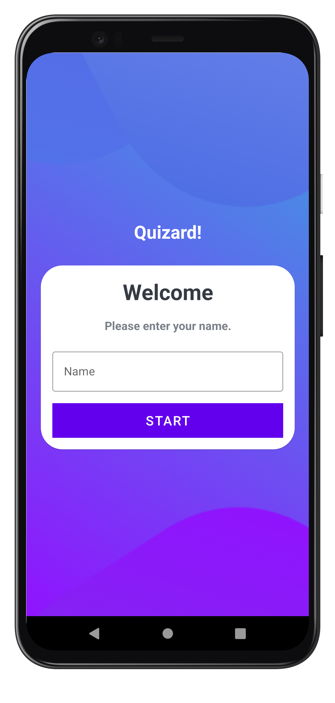
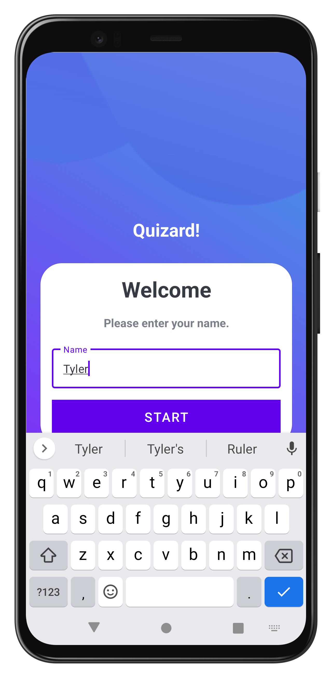
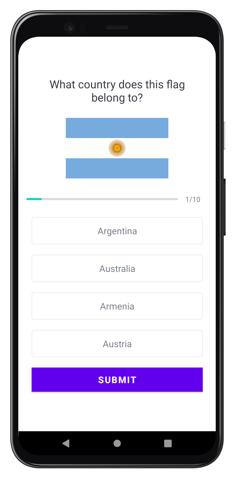
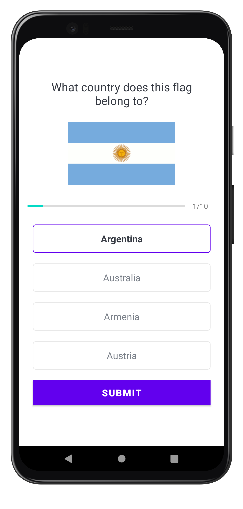
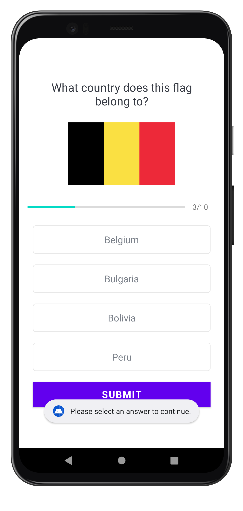
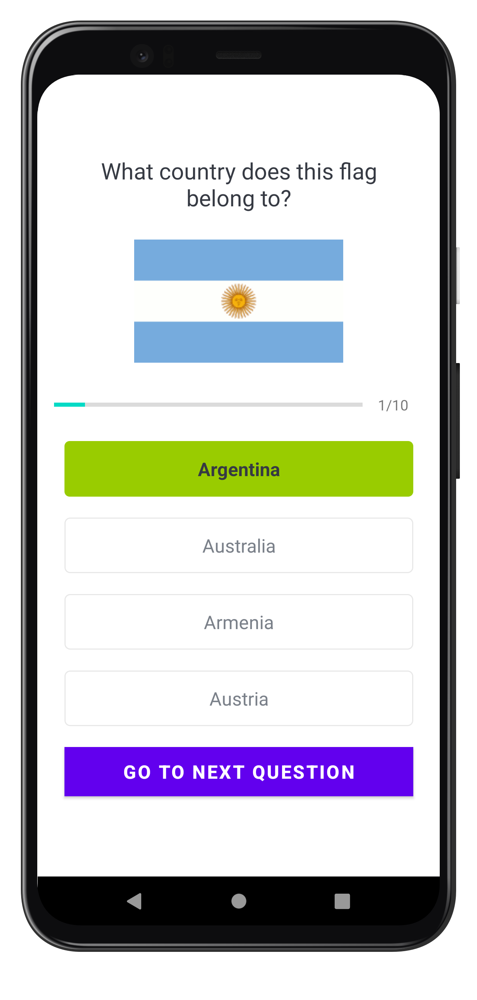
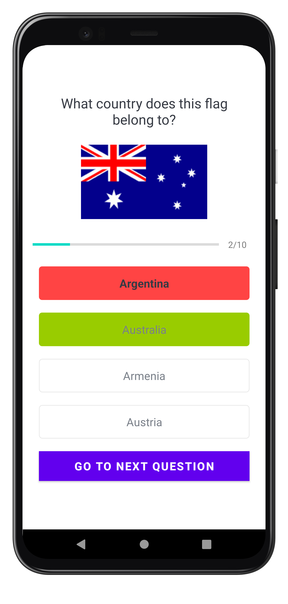

<h1 align="center">Quizard</h1>
<h4 align="center">Multiple Choice Quiz App</h4>

## Description
A multiple choice style quiz app that allows the user to match flags to their repsective countries. Test your knowledge!

Written in [Kotlin](https://kotlinlang.org/) using [MVC](https://medium.com/upday-devs/android-architecture-patterns-part-1-model-view-controller-3baecef5f2b6) architecture, [Timber](https://github.com/JakeWharton/timber) logging library, and [Picasso](https://square.github.io/picasso/) image library. The App strives to create a clean and modern user experience. 

## Improvements
* Add more variety to the result screen
* Add more Countries and flags
* Implement modern icons
* Rework navigation using Jetpack Navigation graph
* Convert [XML](https://developer.android.com/develop/ui/views/layout/declaring-layout) to [Jetpack Compose](https://developer.android.com/jetpack/compose)
* Rewrite from [MVC](https://medium.com/upday-devs/android-architecture-patterns-part-1-model-view-controller-3baecef5f2b6) to [MVVM](https://www.digitalocean.com/community/tutorials/android-mvvm-design-pattern) architecture

## License
	Copyright 2023 Tyler OHearn
	
	Licensed under the Apache License, Version 2.0 (the "License");
	you may not use this file except in compliance with the License.
	You may obtain a copy of the License at
	
	   http://www.apache.org/licenses/LICENSE-2.0
	
	Unless required by applicable law or agreed to in writing, software
	distributed under the License is distributed on an "AS IS" BASIS,
	WITHOUT WARRANTIES OR CONDITIONS OF ANY KIND, either express or implied.
	See the License for the specific language governing permissions and
	limitations under the License.
